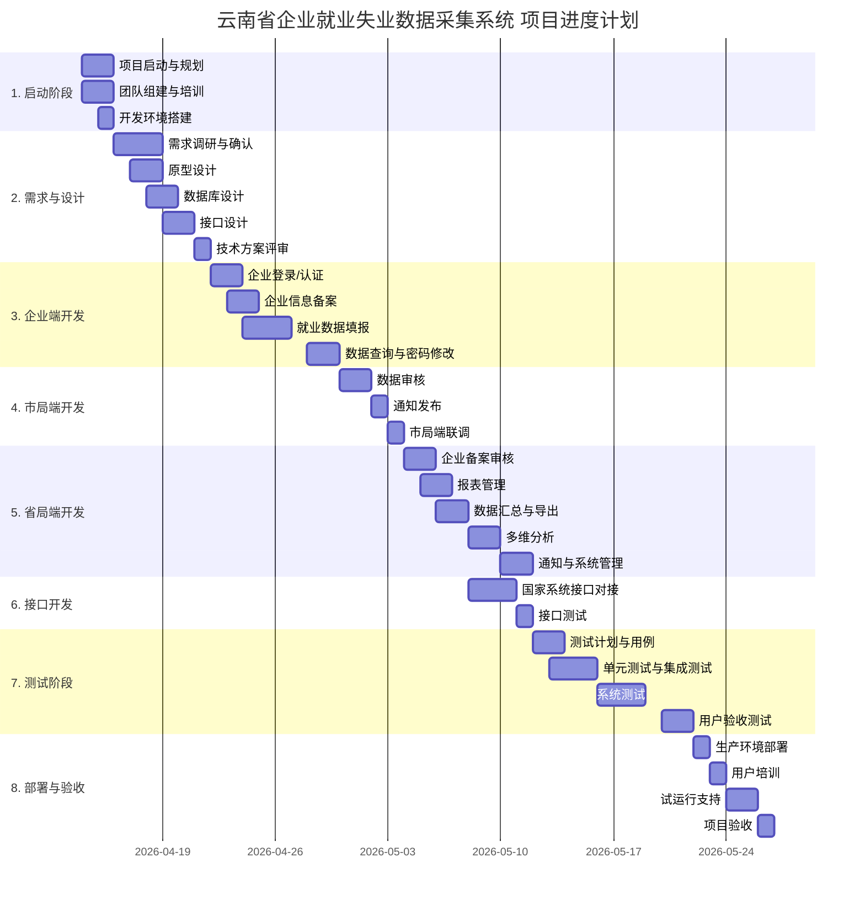

# 云南省企业就业失业数据采集系统——软件项目管理计划

## 文档修订历史

| 版本 | 日期 | 修订人 | 修订说明 | 变更单编号 |
|------|------|--------|----------|-----------|
| v1.0 | 2026-04-1 | 项目经理 | 初稿创建 | - |

---

## 第1章 项目概述

### 1.1 项目名称
云南省企业就业失业数据采集系统

### 1.2 项目背景
根据云南省人社厅就业监测工作需要，建立全省统一的企业就业失业数据采集平台，实现企业数据上报、市县审核、省级汇总分析、上报国家部委的全流程信息化管理。

### 1.3 项目目标（SMART原则）

| 目标维度 | 具体描述 |
|---------|---------|
| **具体性** | 实现企业备案、数据填报、三级审核、汇总分析、通知管理、系统管理六大功能模块 |
| **可测量** | 系统上线后支持≥5000家企业同时填报，单次上报响应<3秒 |
| **可达成** | 团队11人，技术栈成熟（Spring Boot + Vue3） |
| **相关性** | 与国家失业监测系统实现数据接口对接 |
| **时限性** | 2026年5月20日前完成验收交付 |

### 1.4 项目范围边界

| 包含范围 | 不包含范围 |
|---------|-----------|
| 企业端功能（备案、填报、查询） | 企业HR系统集成 |
| 市局端功能（审核、通知） | 移动端APP开发 |
| 省局端功能（汇总、分析、管理） | 历史数据迁移服务 |
| 数据接口（国家系统对接） | 硬件采购与部署 |

---

## 第2章 项目组织与人力资源计划

### 2.1 项目组织结构

采用**矩阵型组织结构**，项目经理向项目管理办公室汇报，各职能经理提供资源支持。

```
┌─────────────────────────────────────────────────┐
│                 项目发起人（省人社厅）              │
└─────────────────────────────────────────────────┘
                        │
┌─────────────────────────────────────────────────┐
│                 项目管理委员会（PMO）             │
└─────────────────────────────────────────────────┘
                        │
┌─────────────────────────────────────────────────┐
│              项目经理（1人）                      │
└─────────────────────────────────────────────────┘
          │              │              │
    ┌─────┴─────┐   ┌─────┴─────┐   ┌─────┴─────┐
    │  需求组   │   │  开发组   │   │  测试组   │
    │ (1人)    │   │ (6人)    │   │ (2人)    │
    └──────────┘   └──────────┘   └──────────┘
                         │
                    ┌────┴────┐
                    │ 配置管理 │
                    │ (1人)   │
                    └─────────┘
```

### 2.2 角色与职责矩阵（RACI）

| WBS任务 | 项目经理 | 需求分析师 | 后端开发 | 前端开发 | 测试 | 配置管理 |
|---------|---------|-----------|---------|---------|------|---------|
| 需求确认 | A | R | C | C | C | I |
| 系统设计 | A | C | R | R | C | I |
| 编码开发 | A | I | R | R | C | C |
| 测试执行 | A | I | C | C | R | I |
| 部署发布 | A | I | C | C | I | R |
| 项目验收 | A | R | C | C | C | I |

*R=负责执行, A=批准, C=咨询, I=知情*

### 2.3 团队人员清单

| 角色 | 人数 | 技能要求 | 主要职责 |姓名|
|------|------|---------|---------|---------------|
| 项目经理 | 1 | PMP认证，5年以上软件项目管理经验 | 整体协调、风险管理、客户沟通 |彭小芳|
| 需求分析师 | 1 | 熟悉政务系统，3年以上经验 | 需求调研、原型设计、需求变更管理 |张子敬|
| 后端开发 | 4 | Java/Spring Boot，2年以上经验 | 业务逻辑、接口开发、数据库设计 |彭希言、汪诗涵、胡瀚、王皓翔|
| 前端开发 | 2 | Vue3/Element Plus，2年以上经验 | 界面开发、图表可视化 |吴珈乐、王李嘉航|
| 测试工程师 | 2 | 熟悉功能测试、性能测试 | 测试用例、测试执行、缺陷跟踪 |雷嘉瑞、刘欣怡|
| 配置管理员 | 1 | 熟悉Git、CI/CD | 版本管理、构建发布、环境维护 |吴文皓|

### 2.4 人员培训计划

| 培训内容 | 培训对象 | 时长 | 培训方式 |
|---------|---------|------|---------|
| 业务需求培训 | 全体 | 0.5天 | 集中讲解 |
| Spring Boot框架 | 后端 | 1天 | 内部培训 |
| Vue3框架 | 前端 | 1天 | 内部培训 |
| 配置管理工具(Git) | 全体 | 0.5天 | 实操培训 |
| 敏捷开发流程 | 全体 | 0.5天 | 集中讲解 |

---

## 第3章 范围计划

### 3.1 需求管理过程

遵循课件第3章的软件需求管理过程：**需求获取 → 需求分析 → 需求规格编写 → 需求验证 → 需求变更**

### 3.2 WBS（工作分解结构）

采用**功能分解法**，共分解为5个层级，最低层工作包控制在40小时以内。

```
1. 云南省企业就业失业数据采集系统
├── 1.1 项目启动与规划（20人天）
│   ├── 1.1.1 项目计划制定
│   ├── 1.1.2 团队组建与培训
│   └── 1.1.3 开发环境搭建
├── 1.2 需求分析与设计（60人天）
│   ├── 1.2.1 需求调研与确认
│   ├── 1.2.2 原型设计
│   ├── 1.2.3 数据库设计
│   ├── 1.2.4 接口设计
│   └── 1.2.5 技术方案评审
├── 1.3 编码开发（240人天）
│   ├── 1.3.1 企业端功能（80人天）
│   │   ├── 1.3.1.1 企业登录/认证
│   │   ├── 1.3.1.2 企业信息备案
│   │   ├── 1.3.1.3 就业数据填报
│   │   ├── 1.3.1.4 数据查询
│   │   └── 1.3.1.5 密码修改
│   ├── 1.3.2 市局端功能（40人天）
│   │   ├── 1.3.2.1 数据审核
│   │   ├── 1.3.2.2 通知发布
│   │   └── 1.3.2.3 密码修改
│   ├── 1.3.3 省局端功能（80人天）
│   │   ├── 1.3.3.1 企业备案审核
│   │   ├── 1.3.3.2 报表管理
│   │   ├── 1.3.3.3 数据汇总与导出
│   │   ├── 1.3.3.4 多维分析（ECharts）
│   │   ├── 1.3.3.5 通知管理
│   │   └── 1.3.3.6 系统管理（用户/角色/时限）
│   └── 1.3.4 数据接口开发（40人天）
│       ├── 1.3.4.1 国家系统接口对接
│       └── 1.3.4.2 接口测试
├── 1.4 测试（80人天）
│   ├── 1.4.1 测试计划与用例
│   ├── 1.4.2 单元测试
│   ├── 1.4.3 集成测试
│   ├── 1.4.4 系统测试
│   └── 1.4.5 用户验收测试
├── 1.5 部署与验收（40人天）
│   ├── 1.5.1 生产环境部署
│   ├── 1.5.2 用户培训
│   ├── 1.5.3 试运行支持
│   └── 1.5.4 项目验收
└── 1.6 项目管理（贯穿全程，80人天）
    ├── 1.6.1 项目跟踪与控制
    ├── 1.6.2 风险管理
    ├── 1.6.3 配置管理
    └── 1.6.4 沟通管理
```

**WBS统计**：总工作包数量 = 36个，总估算人天 = 520人天

### 3.3 WBS字典示例

| WBS标识 | WBS名称 | 描述 | 交付物 | 责任角色 | 完成标准 |
|---------|--------|------|--------|---------|---------|
| 1.3.1.3 | 就业数据填报 | 企业用户按月填报就业人数、减少原因 | 填报功能模块 | 后端+前端 | 通过功能测试，支持必填校验 |
| 1.3.3.4 | 多维分析 | 省局用户进行对比分析、趋势分析 | 分析图表模块 | 后端+前端 | 折线图/饼图正常展示，数据准确 |

---

## 第4章 进度计划

### 4.1 进度估算方法

采用**PERT三点估算法**对关键任务进行估算：

> 期望值 E = (O + 4M + P) / 6
> 标准差 σ = (P - O) / 6

### 4.2 关键路径分析（CPM）

```
任务网络图（关键路径用 → 表示）：

1.1 项目启动(2d) → 1.2 需求分析(6d) → 1.3.1 企业端(8d) → 1.3.2 市局端(4d) → 1.3.3 省局端(8d) → 1.4 测试(10d) → 1.5 部署(5d)
                                    ↘ 1.3.4 接口(4d) ↗
```

**关键路径长度**：2 + 6 + 8 + 4 + 8 + 10 + 5 = 43个工作日

### 4.3 项目进度计划表

| 阶段 | 任务ID | 任务名称 | 工期 | 开始日期 | 结束日期 | 前置任务 |
|------|--------|---------|------|---------|---------|---------|
| 启动 | 1.1 | 项目启动与规划 | 2d | 04-14 | 04-15 | - |
| 需求 | 1.2 | 需求分析与设计 | 6d | 04-16 | 04-21 | 1.1 |
| 开发 | 1.3.1 | 企业端开发 | 8d | 04-22 | 04-29 | 1.2 |
| 开发 | 1.3.2 | 市局端开发 | 4d | 04-30 | 05-03 | 1.3.1 |
| 开发 | 1.3.3 | 省局端开发 | 8d | 05-04 | 05-11 | 1.3.2 |
| 开发 | 1.3.4 | 接口开发 | 4d | 05-08 | 05-11 | 1.3.1（并行） |
| 测试 | 1.4 | 系统测试 | 10d | 05-12 | 05-21 | 1.3.3, 1.3.4 |
| 部署 | 1.5 | 部署与验收 | 5d | 05-22 | 05-26 | 1.4 |
| 收尾 | 1.6 | 项目管理 | 贯穿 | 04-14 | 05-26 | - |

### 4.4 里程碑计划

| 里程碑编号 | 里程碑名称 | 计划日期 | 验收标准 |
|-----------|---------|---------|---------|
| M1 | 需求基线确认 | 04-21 | 需求规格说明书签字确认 |
| M2 | 设计完成 | 04-21 | 数据库设计、接口设计评审通过 |
| M3 | 企业端开发完成 | 04-29 | 企业端功能可演示 |
| M4 | 省市端开发完成 | 05-11 | 省市端功能可演示 |
| M5 | 测试完成 | 05-21 | 测试报告通过，Bug修复率≥95% |
| M6 | 系统上线 | 05-26 | 生产环境部署成功 |
| M7 | 项目验收 | 05-26 | 验收报告签字确认 |

### 4.5 甘特图（Mermaid格式）



---

## 第5章 成本计划

### 5.1 估算方法

采用**功能点估算法**（参照课件第5章国标GB/T 36964-2018）

### 5.2 功能点计算（UFC → FP）

| 功能计数项 | 简单 | 一般 | 复杂 | 小计 |
|-----------|------|------|------|------|
| 外部输入(EI) | 8×3=24 | 6×4=24 | 2×6=12 | 60 |
| 外部输出(EO) | 6×4=24 | 4×5=20 | 2×7=14 | 58 |
| 外部查询(EQ) | 4×3=12 | 3×4=12 | 1×6=6 | 30 |
| 内部逻辑文件(ILF) | 5×7=35 | 3×10=30 | 2×15=30 | 95 |
| 外部接口文件(EIF) | 2×5=10 | 1×7=7 | 0×10=0 | 17 |
| **UFC合计** | | | | **260** |

**技术复杂度因子TCF**：取平均值Fi=3，共14个因子
> TCF = 0.65 + 0.01 × (14 × 3) = 0.65 + 0.42 = **1.07**

**功能点总数**：
> FP = UFC × TCF = 260 × 1.07 = **278 FP**

### 5.3 工作量估算

参照COCOMO模型（课件第5章）：
> 采用Java语言，代码行/FP ≈ 46（根据转换表）
> 总代码行 KLOC = 278 × 46 / 1000 = **12.79 KLOC**

Walston-Felix模型（IBM）：
> E = 5.2 × (KLOC)^0.91 = 5.2 × (12.79)^0.91 = **52 人月**

按11人团队、每月20个工作日计算：
> 人天数 = 52 × 20 = **1040 人天**

### 5.4 成本预算

| 成本科目 | 计算方式 | 金额（万元） |
|---------|---------|------------|
| 开发人员成本（8人） | 8人 × 52人月 × 1.5万/人月 | 624 |
| 测试人员成本（2人） | 2人 × 52人月 × 1.2万/人月 | 124.8 |
| 项目管理成本（1人） | 1人 × 52人月 × 2万/人月 | 104 |
| **直接成本小计** | | **852.8** |
| 管理成本（直接成本15%） | | 127.9 |
| 质量成本（直接成本10%） | | 85.3 |
| **直接+管理+质量** | | **1066** |
| 间接成本（20%） | 房租水电、培训、福利 | 213.2 |
| **项目总估算成本** | | **1279.2** |
| 风险利润（15%） | | 191.9 |
| 税费（6%） | | 76.8 |
| **项目总报价** | | **1547.9 万元** |

### 5.5 成本基线（S曲线）

按月累计成本分布：

| 月份 | 累计成本（万元） | 说明 |
|------|-----------------|------|
| 第1月（04-14~05-13） | 350 | 需求+设计+部分开发 |
| 第2月（05-14~06-13） | 800 | 开发+测试 |
| 第3月（06-14~07-13） | 1150 | 测试+部署+验收 |
| 最终 | 1279 | 项目结束 |

---

## 第6章 质量计划

### 6.1 质量目标（参照课件第6章ISO/IEC 9126模型）

| 质量特性 | 权重 | 目标值 | 测量方法 |
|---------|------|--------|---------|
| 功能性 | 40% | ≥95% | 需求覆盖度测试 |
| 可靠性 | 25% | ≥98% | MTBF > 720小时 |
| 易用性 | 15% | ≥90% | 用户满意度调查 |
| 效率 | 10% | 页面加载<3秒 | 性能测试 |
| 可维护性 | 10% | ≥85% | 代码审查评分 |

**综合质量目标**：≥ 92%

### 6.2 质量保证活动

| QA活动 | 频率 | 负责人 | 输出物 |
|--------|------|--------|--------|
| 需求评审 | 里程碑 | 需求分析师 | 评审报告 |
| 设计评审 | 里程碑 | 技术负责人 | 评审报告 |
| 代码走查 | 每周 | 技术负责人 | 走查记录 |
| 配置审计 | 每周 | 配置管理员 | 审计报告 |
| 过程审计 | 每两周 | QA | 过程审计报告 |

### 6.3 质量控制活动

| QC活动 | 执行人 | 通过标准 |
|--------|--------|---------|
| 单元测试 | 开发人员 | 覆盖率≥80%，所有用例通过 |
| 集成测试 | 测试人员 | 接口100%通过 |
| 系统测试 | 测试人员 | 缺陷修复率≥95% |
| 用户验收测试 | 用户代表 | 验收用例100%通过 |

### 6.4 缺陷跟踪

采用**Bugzilla**进行缺陷跟踪（课件第13章），关键指标：

| 指标 | 目标值 |
|------|--------|
| 缺陷发现到修复平均时间 | < 2天 |
| 严重缺陷数 | 0 |
| 发布前缺陷密度 | < 2个/KLOC |

---

## 第7章 沟通计划

### 7.1 干系人分析（参照课件第7章权力/利益方格）

| 干系人 | 角色 | 权力 | 利益 | 管理策略 |
|--------|------|------|------|---------|
| 省人社厅领导 | 项目发起人 | 高 | 高 | 重点管理，定期汇报 |
| 市局用户 | 最终用户 | 中 | 高 | 保持满意，定期沟通 |
| 企业用户 | 最终用户 | 低 | 高 | 随时告知，培训支持 |
| 项目团队 | 执行者 | 中 | 高 | 密切管理，激励士气 |
| 国家部委 | 外部接口 | 高 | 中 | 保持合规，及时上报 |

### 7.2 沟通矩阵

| 沟通类型 | 频率 | 方式 | 参与者 | 输出 |
|---------|------|------|--------|------|
| 每日站会 | 每天10:00 | 面对面 | 全体 | 进度同步 |
| 周例会 | 每周五16:00 | 会议 | 全体+客户代表 | 周报 |
| 里程碑评审 | 每个里程碑 | 会议+演示 | 全体+客户 | 评审纪要 |
| 项目周报 | 每周 | 电子邮件 | 所有干系人 | 周报文档 |
| 变更控制会议 | 按需 | 会议 | PM+SCCB | 变更单 |
| 项目总结 | 项目结束 | 会议 | 全体 | 总结报告 |

### 7.3 沟通升级原则

当问题在项目组内无法解决时，按以下路径升级：
> 项目经理 → 项目管理办公室 → 项目发起人 → 高层管理者

---

## 第8章 风险计划

### 8.1 风险识别（参照课件第9章风险条目检查表）

| 风险ID | 风险类别 | 风险描述 |
|--------|---------|---------|
| R-01 | 用户风险 | 需求变更频繁，影响进度 |
| R-02 | 技术风险 | 与国家失业监测系统接口对接延迟 |
| R-03 | 人员风险 | 关键人员流失 |
| R-04 | 进度风险 | 估算不准确导致延期 |
| R-05 | 技术风险 | 新技术（ECharts/Spring Boot）掌握不足 |
| R-06 | 资源风险 | 开发环境/服务器资源不足 |
| R-07 | 管理风险 | 沟通不畅导致需求理解偏差 |
| R-08 | 外部风险 | 政策变化导致需求调整 |

### 8.2 风险分析（概率-影响矩阵）

| 风险ID | 概率(P) | 影响(I) | 风险值(P×I) | 优先级 |
|--------|--------|---------|-------------|--------|
| R-01 | 80% | 5 | 4.0 | **高** |
| R-02 | 60% | 4 | 2.4 | 中 |
| R-03 | 40% | 5 | 2.0 | 中 |
| R-04 | 50% | 4 | 2.0 | 中 |
| R-05 | 50% | 3 | 1.5 | 低 |
| R-06 | 30% | 3 | 0.9 | 低 |
| R-07 | 40% | 3 | 1.2 | 低 |
| R-08 | 20% | 4 | 0.8 | 低 |

### 8.3 风险应对计划（Top 10清单）

| 排名 | 风险 | 应对策略 | 预防措施 | 应急措施 | 负责人 |
|------|------|---------|---------|---------|--------|
| 1 | R-01需求变更 | 回避+控制 | 建立需求基线，CCB审批 | 走变更流程，评估影响 | 需求分析师 |
| 2 | R-02接口延迟 | 转移 | 提前与对方技术对接 | 准备Mock数据，并行开发 | 后端Leader |
| 3 | R-03人员流失 | 减轻 | 文档完善，知识共享 | 启动备份人员，交接 | 项目经理 |
| 4 | R-04进度延期 | 减轻 | 采用PERT估算，设置缓冲 | 赶工、快速跟进 | 项目经理 |
| 5 | R-05技术不足 | 转移 | 安排技术培训 | 引入外部咨询 | 技术负责人 |

### 8.4 风险储备

| 储备类型 | 比例 | 金额（万元） | 说明 |
|---------|------|-------------|------|
| 应急储备 | 10% | 127.9 | 应对已识别风险 |
| 管理储备 | 5% | 63.9 | 应对未识别风险 |

---

## 第9章 配置管理计划

### 9.1 配置管理环境

| 项目 | 选择 | 说明 |
|------|------|------|
| 版本控制工具 | Git | 分布式，支持分支管理 |
| 代码托管平台 | GitLab | 私有部署，支持CI/CD |
| 配置库结构 | 主干/分支模型 | Git Flow |

### 9.2 配置库目录结构

```
/repo/yunnan-job-monitor
├── trunk/                    # 主干（稳定版本）
│   ├── backend/              # 后端代码
│   ├── frontend/             # 前端代码
│   └── database/             # 数据库脚本
├── branches/                 # 分支
│   ├── feature/              # 功能分支
│   └── release/              # 发布分支
└── tags/                     # 标签（版本标记）
    ├── v1.0.0/
    └── v1.1.0/
```

### 9.3 配置项标识规范（参照课件第11章）

| 类型 | 命名规范 | 示例 |
|------|---------|------|
| 需求文档 | YN_REQ_版本号.docx | YN_REQ_v1.0.docx |
| 设计文档 | YN_DES_模块名_版本号.docx | YN_DES_db_v1.0.docx |
| 源代码 | 按模块组织 | /backend/src/main/java/... |
| 测试用例 | YN_TEST_模块名_版本号.xlsx | YN_TEST_fill_v1.0.xlsx |

### 9.4 基线定义

| 基线名称 | 包含配置项 | 建立时间 |
|---------|-----------|---------|
| 需求基线 | 需求规格说明书、原型 | M1（04-21） |
| 设计基线 | 数据库设计、接口设计 | M2（04-21） |
| 产品基线 | 源代码、部署包、用户手册 | M7（05-26） |

### 9.5 变更控制流程

变更控制流程：
> CR提交 → SCCB评估 → 影响分析 → 审批 → 实施变更 → 验证 → 关闭

**SCCB成员**：项目经理、需求分析师、技术负责人、客户代表

---

## 第10章 合同计划

### 10.1 合同类型

采用**固定总价合同（FFP）**

| 合同要素 | 内容 |
|---------|------|
| 合同金额 | 1547.9万元 |
| 付款方式 | 按里程碑分期支付 |
| 交付物 | 系统源代码、部署包、用户手册、验收报告 |
| 质保期 | 12个月 |

### 10.2 里程碑付款计划

| 里程碑 | 付款比例 | 累计付款 |
|--------|---------|---------|
| 合同签订 | 20% | 309.6万 |
| 需求确认（M1） | 15% | 232.2万 |
| 设计完成（M2） | 15% | 232.2万 |
| 开发完成（M4） | 30% | 464.4万 |
| 验收通过（M7） | 20% | 309.6万 |

---

## 第11章 集成计划（执行与控制）

### 11.1 项目控制方法

参照课件第13章，采用**挣值管理（EVM）**进行项目绩效跟踪

| 指标 | 计算公式 | 监控频率 |
|------|---------|---------|
| PV（计划价值） | 计划完成工作的预算 | 每周 |
| EV（挣值） | 实际完成工作的预算 | 每周 |
| AC（实际成本） | 实际花费 | 每周 |
| CV（成本偏差） | EV - AC | 每周 |
| SV（进度偏差） | EV - PV | 每周 |
| CPI（成本绩效指数） | EV / AC | 每两周 |
| SPI（进度绩效指数） | EV / PV | 每两周 |
| EAC（完工估算） | BAC / CPI | 每月 |

### 11.2 控制阈值

| 偏差类型 | 容忍阈值 | 触发行动 |
|---------|---------|---------|
| 进度偏差(SV) | ±10% | 分析原因，调整计划 |
| 成本偏差(CV) | ±15% | 审查支出，控制成本 |
| 质量缺陷率 | >5% | 增加测试，代码重构 |
| 风险发生 | 任何 | 启动应急预案 |

### 11.3 项目跟踪工具

| 工具 | 用途 |
|------|------|
| Microsoft Project | 进度计划与跟踪 |
| GitLab Issues | 任务分配与跟踪 |
| Bugzilla | 缺陷跟踪 |
| Confluence | 文档管理 |

---

## 第12章 项目结束过程

### 12.1 验收标准

| 验收项 | 标准 |
|--------|------|
| 功能完整性 | 100%满足需求规格说明书 |
| 性能指标 | 并发500用户，响应<3秒 |
| 文档完整性 | 用户手册、部署文档、源代码齐全 |
| 测试通过率 | 功能测试100%，缺陷修复率≥95% |
| 用户培训 | 完成培训，用户可独立操作 |

### 12.2 验收交付物清单

| 序号 | 交付物 | 格式 |
|------|--------|------|
| 1 | 需求规格说明书 | Word/PDF |
| 2 | 系统设计文档 | Word/PDF |
| 3 | 数据库设计文档 | Word/PDF |
| 4 | 源代码 | Git仓库 |
| 5 | 可执行程序 | Jar包/War包 |
| 6 | 用户手册 | Word/PDF |
| 7 | 部署文档 | Word/PDF |
| 8 | 测试报告 | Word/PDF |
| 9 | 项目总结报告 | Word/PDF |
| 10 | 验收报告 | Word/PDF |

### 12.3 项目总结内容

参照课件第15章，项目总结包括：
- 项目目标达成情况
- 进度、成本、质量偏差分析
- 经验教训总结
- 团队成员绩效评价
- 过程资产归档

### 12.4 团队解散

| 步骤 | 内容 | 负责人 |
|------|------|--------|
| 1 | 确认所有任务完成 | 项目经理 |
| 2 | 知识转移与文档归档 | 配置管理员 |
| 3 | 资源回收（开发环境等） | 运维 |
| 4 | 绩效考核与评价 | 项目经理 |
| 5 | 团队解散会议 | 项目经理 |

---

## 附录

### 附录A：项目计划迭代历史

| 版本 | 日期 | 变更说明 | 变更单 |
|------|------|---------|--------|
| v1.0 | 04-13 | 初版项目计划 | - |
| v1.1 | 04-14 | 细化各项工作流程，添加成本控制等内容 |-|

### 附录B：关键路径网络图

```
[节点1] 项目启动(2d) → [节点2] 需求分析(6d) → [节点3] 企业端(8d) → [节点4] 市局端(4d) → [节点5] 省局端(8d) → [节点6] 测试(10d) → [节点7] 部署(5d)
                                                                           ↗
                                          [节点8] 接口开发(4d) ----------→
```

**关键路径长度**：43天
**总浮动时间**：0天（关键路径上所有活动）

### 附录C：风险登记册

| ID | 风险描述 | 概率 | 影响 | 风险值 | 应对策略 | 应急计划 | 负责人 |
|----|---------|------|------|--------|---------|---------|--------|
| R-01 | 需求变更 | 80% | 5 | 4.0 | 回避 | 变更控制流程 | 需求分析师 |
| R-02 | 接口延迟 | 60% | 4 | 2.4 | 转移 | Mock数据方案 | 后端Leader |
| R-03 | 人员流失 | 40% | 5 | 2.0 | 减轻 | 知识共享+备份 | 项目经理 |

---

*文档编制人：项目经理*
*编制日期：2026-04-8*
*文档版本：v1.1*